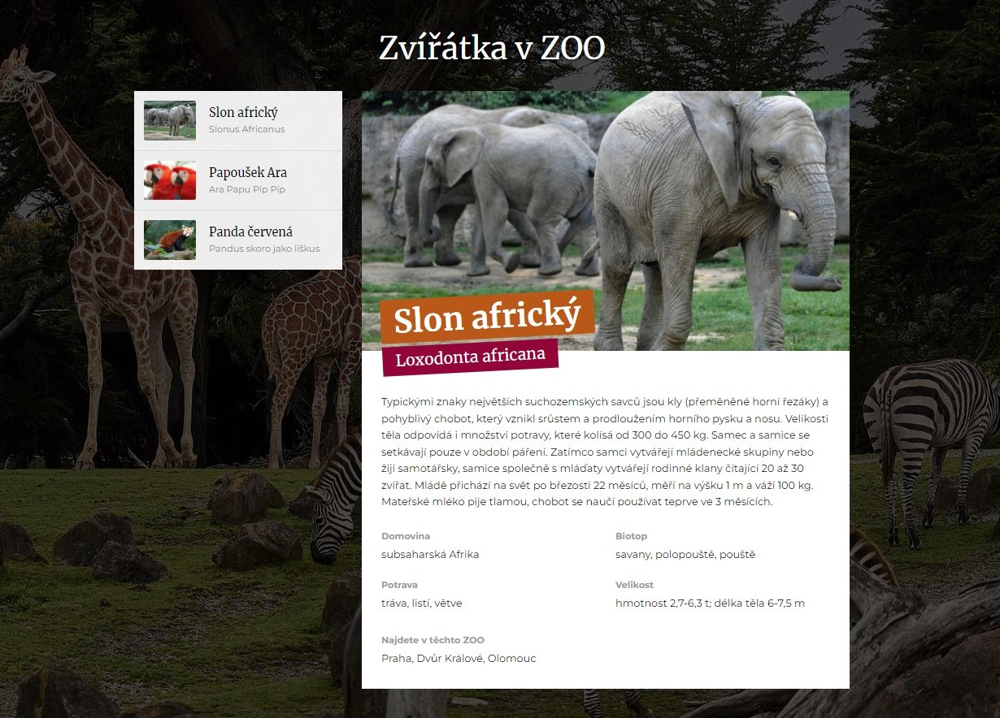
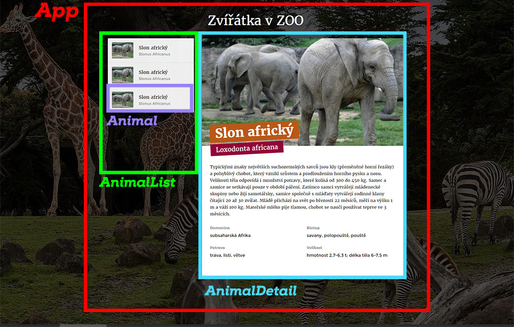

# Cvičný projekt: Zvířátka

Za úkol máš vyrobit aplikaci, která zobrazuje seznam zvířátek v ZOO. Když klikneš na zvířátko v seznamu, zobrazí se vpravo jeho detailní popis.

Tentokrát není zadání popsané krok za krokem, na poustu věcí si musíš přijít sama. Až bude aplikace hotová, měla by vypadat nějak takto:




## Založení projektu na GitHubu a jeho spuštění

1. Pomocí tlačítka **Use this template** a potom **Create a new repository** si udělej kopii tohoto zadání do svého GitHub účtu.
1. Nově vytvořený repozitář si naklonuj k sobě na počítač.
1. Ve složce projektu spusť `npm install` a dosinstaluj si potřebné závislosti.


## Zadání úkolu

Tvým cílem je vytvořit stránku, která bude zobrazovat na levé straně seznam zvířat a na pravé straně detail vybraného zvířete.

1. Aplikaci budeš tvořit jako vždy ve složce `src`. Když se ale podíváš do složky `html-vzor`, máš tam připravený vzhled aplikace v podobě hotového HTML, CSS a připravených obrázků.

2. Vytvoř si komponenty:

	- `AnimalList` - to bude seznam všech zvířátek na levé straně obrazovky
	- `Animal` - to bude jedno zvířátko v seznamu (je v něm malá fotečka a český a latinský název)
	- `AnimalDetail`- to bude detail rozkliknutého zvířete s velkou fotkou a všemi podrobnostmi

	Vezmi vzorové HTML a CSS a rozkouskuj ho do příslušných komponent.

	


3. Obrázky ze složky `images` uvnitř `html-vzor` nemusíš do `src` kopírovat. V datech o zvířatkách (viz. další kroky) budou odkazy na obrázky přímo z internetu. Do aplikace si potřebuješ zkopírovat pouze obrázek `zoo.jpg`, který se v CSS používá jako pozadí celé stránky. Nezapomeň v CSS upravit cestu tak, aby správně reflektovala jeho nové umístění.

4. V hlavní App si vytvoř stavovou proměnnou. Použij `useEffect`, který při **prvním** zobrazení komponenty App stáhne data o zvířatech a uloží je to stavu.

	Data najdeš na adrese:
	```
	https://lrolecek.github.io/zviratka-api/zvirata.json
	```
	Podívej se, jak data vypadají: [ukázka](https://lrolecek.github.io/zviratka-api/zvirata.json). Nepotřebuješ k nim žádný API klíč, jsou veřejně přístupná. Stačí udělat `fetch` na tuto adresu a data jsou tvoje.

	**Opravdu** prozkoumej, jak data vypadají, ať víš, co si máš z obdržených dat do stavu uložit.

6. Další postup je "jednoduchý":

	- v `App` načti data
	- v `App` zobraz komponenty `AnimalList` a `AnimalDetail`
	- do `AnimalList` předej načtená data
	- v `AnimalList` zobraz seznam zvířat - pro každé zvíře v poli jedna komponenta `Animal`
	- v `AnimalList` reaguj na kliknutí na `Animal` - pokud k tomu dojde, řekni rodičovské komponentě (App), jaké zvíře se má zobrazit uvnitř komponenty `AnimalDetail`
	- po startu aplikace (a po načtení dat) se automaticky zobrazí první zvíře v seznamu

## Bonus 1

7. V datech o každém zvířeti je i pole nazvané `zoo`, které obsahuje identifikátory zoologických zahrad, do kterých se můžeš jít na dané zvířátko podívat.

	Seznam Zoologických zahrad si můžeš načíst z adresy:
	```
	https://lrolecek.github.io/zviratka-api/zoo.json
	```
	→ [Ukázka dat](https://lrolecek.github.io/zviratka-api/zoo.json)

8. V detailu zvířete zobraz jména zoologických zahrad, kde se zvíře nachází.


## Bonus 2

Extra bonus pro šprtky a šprty:

9. Vyrob komponentu `Search` a umísti ji nad seznam zvířat. V komponentě bude textové pole, do kterého lze psát.

10. Zařiď, aby se v seznamu zvířat zobrazovala jen ta zvířata, jejichž český nebo latinský nápis obsahuje napsaný text. Tj. komponenta `Search` musí komunikovat do `App`, jaká data má `App` vyfiltrovat ze seznamu všech zvířat a jen ty pak poslat do komponenty `AnimalList`.

11. Když hledání nebude odpovídat žádné zvíře, zobrazí se v komponentě hláška o tom, že hledání nic nenašlo.
